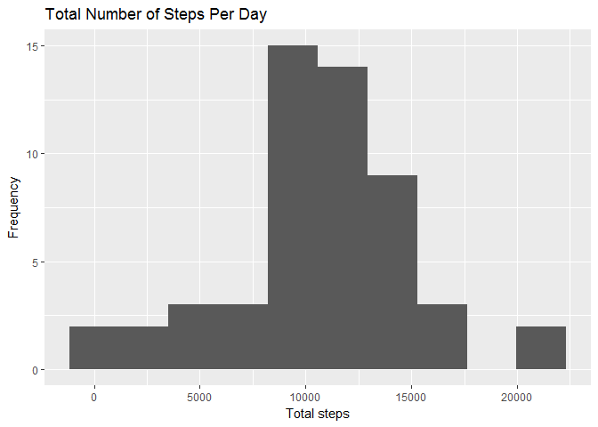
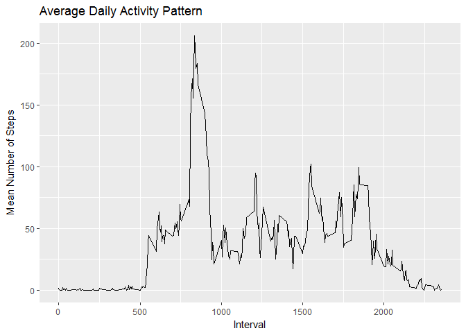
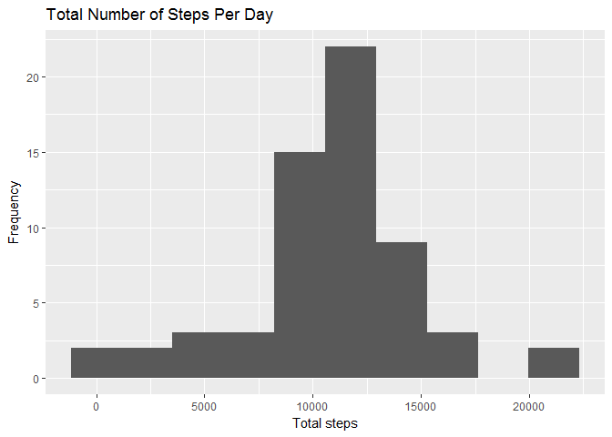
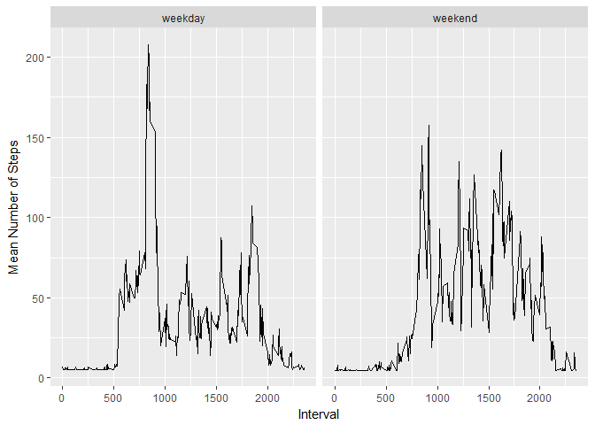

PA1\_template.Rmd
================
Allison Harney
June 22, 2018

Reproducible Research: Project 1
================================

``` r
knitr::opts_chunk$set(echo = TRUE)

library(ggplot2)
library(dplyr)
```

    ## 
    ## Attaching package: 'dplyr'

    ## The following objects are masked from 'package:stats':
    ## 
    ##     filter, lag

    ## The following objects are masked from 'package:base':
    ## 
    ##     intersect, setdiff, setequal, union

**Loading and preprocessing the data**
--------------------------------------

### 1. Code for reading in the dataset and/or processing data

``` r
if(!file.exists('activity.csv')){
    unzip('activity.zip')
}
activity <- read.csv('activity.csv')
```

**What is mean total number of steps taken per day?**
-----------------------------------------------------

### 2. Histogram of the total number of steps taken each day

``` r
steps <- activity %>%
        group_by(date)%>%
        summarize(stepsperday = sum(steps))
ggplot(steps, aes(stepsperday)) + geom_histogram(bins = 10) + 
    xlab("Total steps") + ylab("Frequency") + ggtitle("Total Number of Steps Per Day")
```

    ## Warning: Removed 8 rows containing non-finite values (stat_bin).



### 3.Mean and median number of steps taken each day

Mean number of steps per day with NA removed

``` r
stepsByDayMean <- mean(steps$stepsperday, na.rm = TRUE)
print(stepsByDayMean)
```

    ## [1] 10766.19

Median number of steps per day with NA removed

``` r
stepsByDayMedian <- median(steps$stepsperday, na.rm = TRUE)
print(stepsByDayMedian)
```

    ## [1] 10765

The mean number of steps taken each day was 1.076618910^{4}. The median number of steps taken each day was 10765.

**What is the average daily pattern?**
--------------------------------------

### 4. Time series plot of the average number of steps taken

``` r
time <- activity %>%
        group_by(interval)%>%
        summarize(meanstepsperday = mean(steps, na.rm = TRUE))
ggplot(time, aes(y = meanstepsperday, x = interval)) + geom_line() + 
    xlab("Interval") + ylab("Mean Number of Steps") + ggtitle("Average Daily Activity Pattern")
```



### 5. The 5-minute interval that, on average, contains the maximum number of steps

``` r
five <- time %>%
    filter(meanstepsperday == max(meanstepsperday))
print(five)
```

    ## # A tibble: 1 x 2
    ##   interval meanstepsperday
    ##      <int>           <dbl>
    ## 1      835            206.

The 5-minute interval of 835 on average contains the maximum number of steps per days with 206.1698113 steps per day.

**Imputing missing values**
---------------------------

### 6. Code to describe and show a strategy for imputing missing data

``` r
missing <- activity %>%
    summarize(sum(is.na(activity)))
print(missing)
```

    ##   sum(is.na(activity))
    ## 1                 2304

There are 2304 missing values in the data set. For all missing values, the average number of steps from the entire data set will be used.

``` r
imputed <- activity %>%
    mutate(steps = replace(steps, is.na(steps), mean(steps, na.rm = TRUE)))
```

### 7. Histogram of the total number of steps taken each day after missing values are imputed

``` r
steps_imputed <- imputed %>%
            group_by(date)%>%
            summarize(stepsperday = sum(steps))
ggplot(steps_imputed, aes(stepsperday)) + geom_histogram(bins = 10) + 
    xlab("Total steps") + ylab("Frequency") + ggtitle("Total Number of Steps Per Day")
```



``` r
meanImputed <- mean(steps_imputed$stepsperday)
print(meanImputed)
```

    ## [1] 10766.19

``` r
medianImputed <- median(steps_imputed$stepsperday)
print(medianImputed)
```

    ## [1] 10766.19

The mean number of steps per day in the imputed data set is 1.076618910^{4}. The median number of steps per day in the imputed data set is 1.076618910^{4}.

The mean number of steps per day remains the same after imputation as the original dataset. The median is slightly higher such that the median now equals the mean value.

**Are there differences in activity pattern between weekdays and weekends?**
----------------------------------------------------------------------------

### 8. Panel plot comparing the average number of steps taken per 5-minute interval across weekdays and weekends

``` r
imputed <- mutate(imputed, date = as.Date(date))

weekdays <- imputed%>%
    mutate(day = weekdays(date))%>%
    mutate(weekend = ifelse(day == "Saturday" | day == "Sunday", "weekend", "weekday") )

weekdays_steps <- weekdays %>%
            group_by(weekend, interval)%>%
            summarize(meanstepsperday = mean(steps, na.rm = TRUE))

ggplot(weekdays_steps, aes(y = meanstepsperday, x = interval))  + geom_line() + facet_wrap(~weekend) +
    xlab("Interval") + ylab("Mean Number of Steps") 
```


